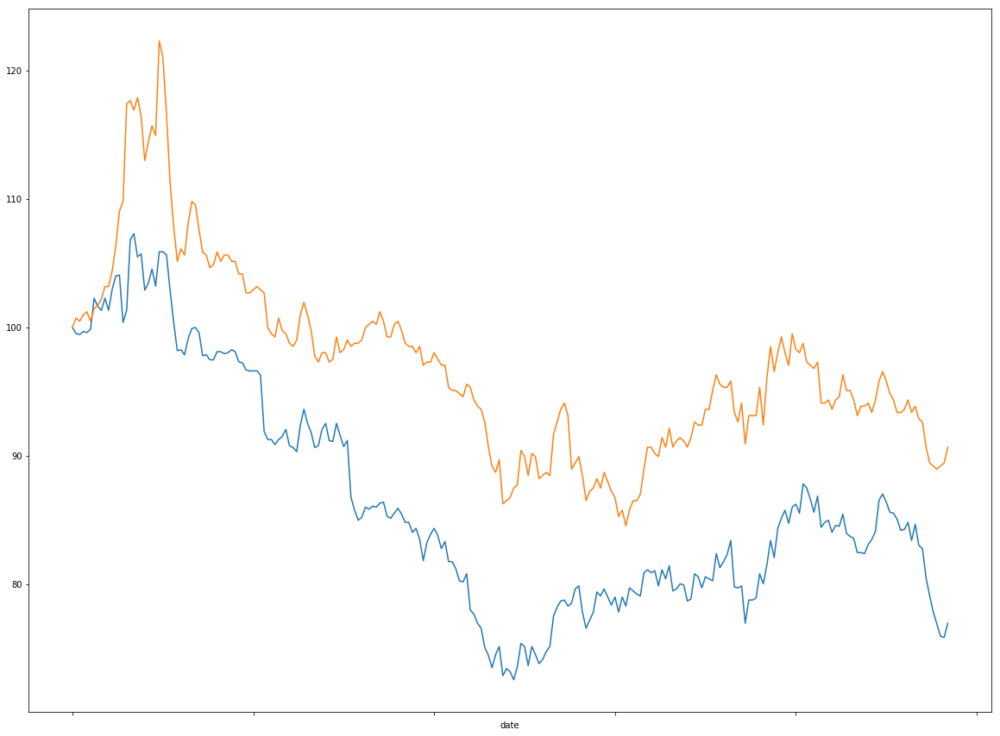

---
title: 两股票历史价格比较
date: 2019-06-22
id: 1
categories: [Quant量化交易, 项目]
---

## 项目任务
1. 获取财务数据
2. 填充缺失值
3. 数据归一化
4. 折线图

## 代码

### 依赖


```python
import matplotlib.pyplot as plt
import numpy as np
import pandas as pd
import tushare as ts
import ssl
context = ssl._create_unverified_context()
```

### 获取财务数据


```python
s_pf = '600000'
s_gd = '601818'
sdate = '2018-01-01'
edate = '2018-12-31'

df_pf = ts.get_hist_data(s_pf, start = sdate, end = edate).sort_index(axis = 0, ascending = True)
df_gd = ts.get_hist_data(s_gd, start = sdate, end = edate).sort_index(axis = 0, ascending = True)
```

### 数据处理


```python
df = pd.concat([df_pf.close, df_gd.close], axis = 1, keys = ['pf_clse','gd_close'])
df.ffill(axis = 0, inplace = True)

df['pf_one'] = df_pf.close / float(df_pf.close[0]) * 100
df['gd_one'] = df_gd.close / float(df_gd.close[0]) * 100

display(df.corr(method = 'pearson', min_periods = 1))
```


<div>
<style scoped>
    .dataframe tbody tr th:only-of-type {
        vertical-align: middle;
    }

    .dataframe tbody tr th {
        vertical-align: top;
    }

    .dataframe thead th {
        text-align: right;
    }
</style>
<table border="1" class="dataframe">
  <thead>
    <tr style="text-align: right;">
      <th></th>
      <th>pf_clse</th>
      <th>gd_close</th>
      <th>pf_one</th>
      <th>gd_one</th>
    </tr>
  </thead>
  <tbody>
    <tr>
      <th>pf_clse</th>
      <td>1.000000</td>
      <td>0.912252</td>
      <td>1.000000</td>
      <td>0.912252</td>
    </tr>
    <tr>
      <th>gd_close</th>
      <td>0.912252</td>
      <td>1.000000</td>
      <td>0.912252</td>
      <td>1.000000</td>
    </tr>
    <tr>
      <th>pf_one</th>
      <td>1.000000</td>
      <td>0.912252</td>
      <td>1.000000</td>
      <td>0.912252</td>
    </tr>
    <tr>
      <th>gd_one</th>
      <td>0.912252</td>
      <td>1.000000</td>
      <td>0.912252</td>
      <td>1.000000</td>
    </tr>
  </tbody>
</table>
</div>


### 画图


```python
df.pf_one.plot(figsize = (20,15))
df.gd_one.plot(figsize = (20,15))
```


    <matplotlib.axes._subplots.AxesSubplot at 0x11bcdfef0>





> 参考：

1. [廖雪峰Python数据分析](https://www.julyedu.com/course/getDetail/66/)
2. [Tushare官网](http://tushare.org/)
